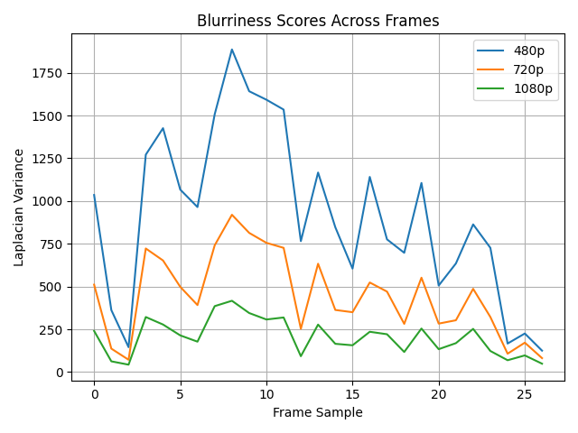

### 🔹 Project Title

```
# 🎥 VidSage – Smart Video Transcoder & Analyzer
```

### 🔹 Description

```markdown
VidSage is a Python-powered tool that automates video transcoding, stream metadata extraction, and visual quality analysis. Built with FFmpeg and OpenCV, it simulates key components of real-world video streaming pipelines like those used in OTT, broadcast, and video QA systems.

It helps you:
- Transcode videos to multiple resolutions
- Analyze blurriness using Laplacian variance
- Extract codec, bitrate, and resolution info
- Generate visual reports with plots and markdown
```

### 🔹 Demo Screenshot

```markdown

```

### 🔹 Features

```markdown
- ✅ FFmpeg-powered multi-resolution transcoding (480p, 720p, 1080p)
- ✅ Real-time video quality scoring via blur detection
- ✅ Stream metadata extraction using ffprobe
- ✅ Report generation (Markdown + plot)
```

### 🔹 Tech Stack

```markdown
- Python
- FFmpeg & ffprobe
- OpenCV
- Matplotlib
- Pandas
```

### 🔹 Folder Structure

```markdown
vidsage/
├── input/             # Raw videos
├── output/            # Transcoded videos + report
├── transcoder.py      # FFmpeg transcoding
├── quality_metrics.py # Blur detection
├── utils.py           # Metadata extraction
├── analyzer.py        # Main script
└── requirements.txt
```

### 🔹 Setup & Usage

```bash
# Clone this repo
git clone https://github.com/yourusername/vidsage.git
cd vidsage

# Install dependencies
pip install -r requirements.txt

# Add your test video
mv somevideo.mp4 input/sample.mp4

# Run analysis
python analyzer.py
```

### 🔹 Output

* `output/report.md`: Textual summary
* `output/blur_plot.png`: Visual analysis
* Transcoded videos: `*_480p.mp4`, `*_720p.mp4`, etc.

